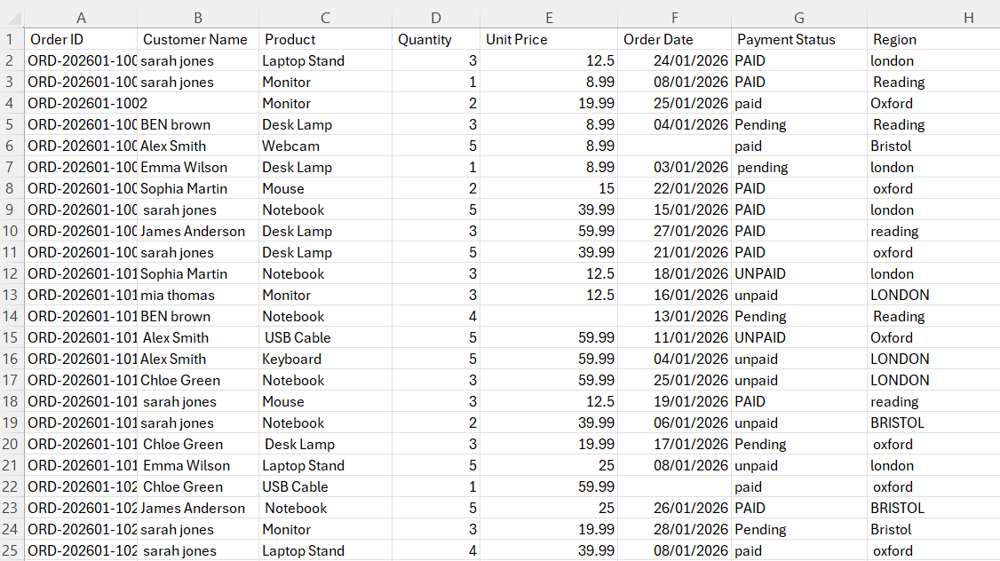
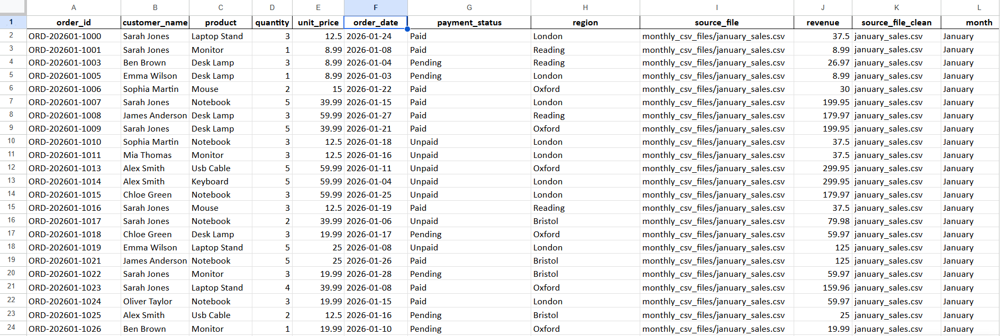
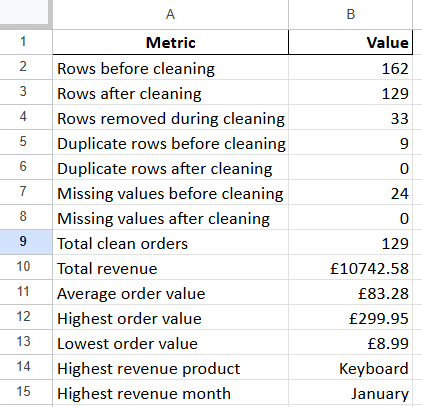

# CSV File Merger and Cleaner Project

## Project Overview

This project demonstrates how Python and pandas can be used to combine multiple messy monthly CSV files into one clean master dataset.

The project simulates a common freelance task where a client has separate CSV files for different months and needs them cleaned, combined and turned into a structured sales report.

The original files contained duplicate rows, missing values, inconsistent text formatting, messy column names and mixed date formats.

The final output is a cleaned master Excel file and a multi-sheet sales report.

## Before and After

### Messy Monthly CSV File

### Cleaned Master Dataset

### Summary Report

## Tools Used

* Python
* pandas
* Google Colab
* CSV files
* Excel

## Problems in the Original Data

The original monthly CSV files contained:

* Separate files for January, February and March
* Messy column names with extra spaces
* Duplicate rows
* Missing customer names
* Missing quantities
* Missing unit prices
* Missing order dates
* Inconsistent capitalisation
* Extra spaces in text fields
* Mixed date formats
* No revenue column

## Cleaning and Merging Steps Completed

1. Created three messy monthly CSV files.
2. Loaded all CSV files from a folder using Python.
3. Added a source file column to track where each row came from.
4. Combined the monthly CSV files into one master dataset.
5. Inspected the combined dataset using `df.info()`.
6. Checked missing values using `df.isna().sum()`.
7. Checked duplicate rows using `df.duplicated().sum()`.
8. Created a before-cleaning data quality report.
9. Cleaned column names by removing spaces, converting to lowercase and replacing spaces with underscores.
10. Removed duplicate rows.
11. Cleaned text formatting across customer names, products, payment statuses and regions.
12. Removed rows missing critical values.
13. Standardised mixed date formats.
14. Added a revenue column using quantity multiplied by unit price.
15. Created sales summary results.
16. Grouped revenue by product.
17. Grouped revenue by region.
18. Created a payment status summary.
19. Created revenue by month.
20. Exported a cleaned master Excel file.
21. Exported a multi-sheet Excel sales report.

## Results

The final cleaned master dataset contained:

* Original combined dataset: 162 rows
* Final cleaned dataset: 129 clean records
* Rows removed during cleaning: 33
* 0 duplicate rows
* 0 missing critical values
* Clean column names
* Standardised text formatting
* Standardised date formatting
* A new revenue column

Sales summary:

* Total revenue: £10,742.58
* Highest revenue product: Keyboard
* Highest revenue month: January

## Final Outputs

* `03_monthly_csv_files.zip` — original monthly CSV files
* `04_cleaned_master_sales_data.xlsx` — cleaned combined master file
* `05_csv_merger_sales_report.xlsx` — multi-sheet Excel sales report
* `02_CSV_File_Merger_and_Cleaner_Project.ipynb` — Python notebook showing the full workflow
* `06_before_screenshot.png` — screenshot of a messy monthly CSV file
* `07_after_screenshot.png` — screenshot of the cleaned master dataset
* `08_report_summary_screenshot.png` — screenshot of the summary report

## Skills Demonstrated

* Loading multiple CSV files
* Combining multiple files into one master dataset
* Tracking source files
* CSV data cleaning
* Duplicate removal
* Missing value handling
* Text standardisation
* Date standardisation
* Calculated revenue columns
* Group-by sales analysis
* Multi-sheet Excel report exporting
* Python and pandas workflow

## Freelance Relevance

This project is similar to real freelance tasks where clients need help combining multiple CSV or Excel files into one clean master spreadsheet.

It supports services such as:

* Combining multiple CSV files
* Combining multiple Excel files
* Cleaning messy sales data
* Creating master spreadsheets
* Creating simple sales summary reports
* Automating repetitive spreadsheet tasks
